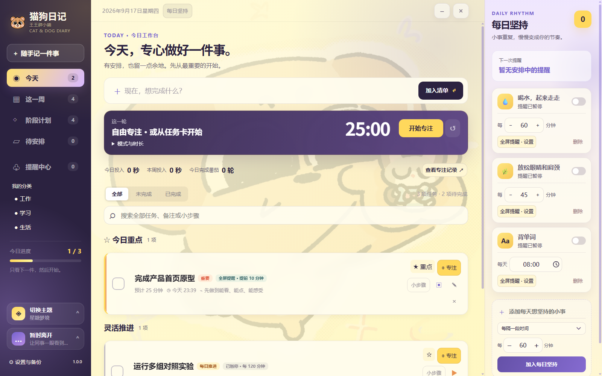
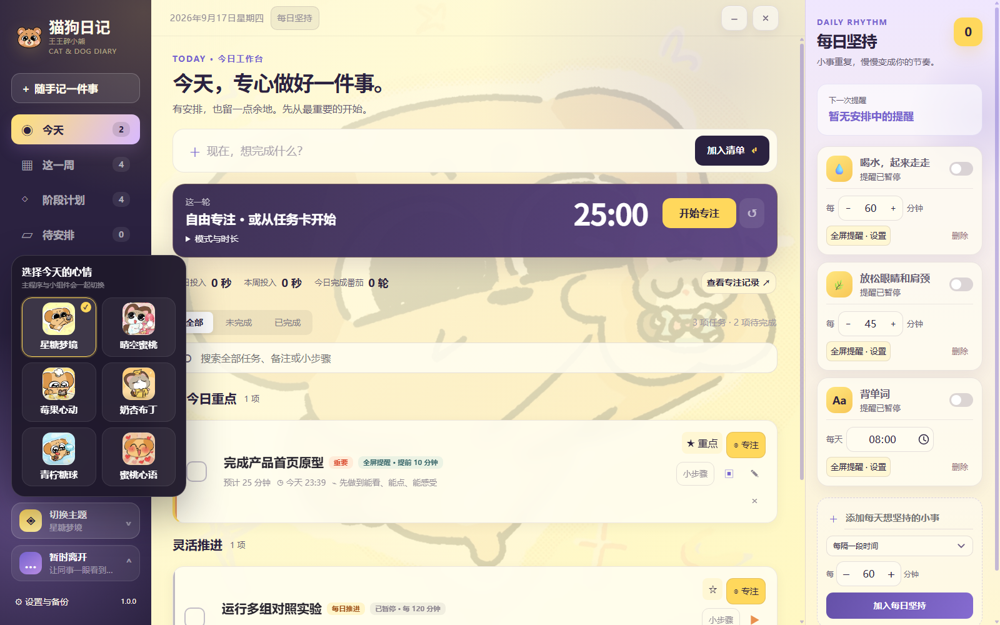
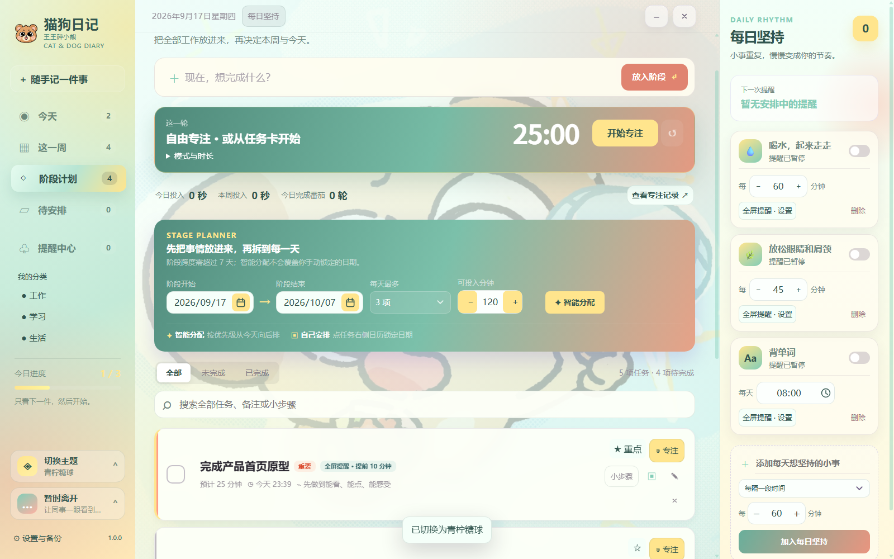
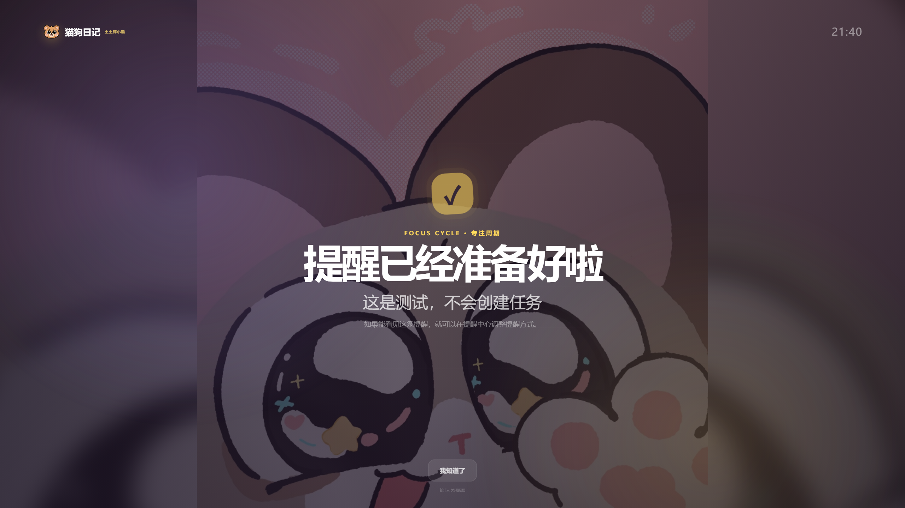

# 猫狗日记 Cat & Dog Diary

一款本地优先的 Windows 待办、提醒与番茄钟应用。它把“随手记下来、按时提醒、专心做完”放在同一个界面里，并保留六套猫狗主题、全屏提醒和透明桌面小组件。

> Windows 稳定版：**1.0.0** · Android 同步内测：**1.1.0-beta.3** · 默认本地优先 · 无遥测

[下载 1.0.0](https://github.com/dokibeartwo/cat-dog-diary/releases/tag/v1.0.0)　·　[使用说明](使用说明.md)　·　[隐私说明](PRIVACY.md)　·　[同步内测进展](RELEASE-1.1.0-BETA.3.md)　·　[1.0.0版本说明](RELEASE-1.0.0.md)



## 为什么做它

很多待办软件适合列清单，却不够擅长提醒；番茄钟又常常与任务分开。猫狗日记把任务、阶段计划、每日坚持、提醒中心和专注计时放在一起，尽量减少“先配置很久，最后反而没开始”的负担。

## 主要功能

- **今天工作台**：今日重点、定时事项、灵活推进和之前未完成，支持分类、搜索与小步骤。
- **快速记录**：`Ctrl + Alt + N` 唤起输入，窗口内 `Ctrl + K` 定位输入；中文日期和时间先解析为预览，确认后再保存。
- **灵活计划**：任务可以指定日期时间、只安排到某一天、留在待安排，或每天持续推进；计划执行时间与最晚截止日期分开。
- **提醒中心**：轻提示、全屏提醒、自选稍后时长、勿扰时段、处理历史与暂缓原因。
- **番茄专注**：关联任务，全屏倒计时；按 `Esc` 收起后在桌面小组件继续显示同一轮计时。
- **阶段排期**：按截止、优先级、预计分钟和每日容量生成预览，确认后才应用。
- **每日坚持**：支持每隔一段时间或每天固定时间提醒，可设置星期、时段和展示方式。
- **本地数据保护**：自动备份、手动备份、导入导出、恢复预览和任务回收站。
- **六套主题**：主程序、小组件、提醒和所有日期／时间控件同步换色。

## 界面示例

### 六套主题切换



### 阶段计划与容量排期



### 全屏提醒



### 专注小组件


## 下载与运行

1. 打开 [v1.0.0 Release](https://github.com/dokibeartwo/cat-dog-diary/releases/tag/v1.0.0)。
2. 下载 `cat-dog-diary-1.0.0-windows-x64.zip`。
3. 完整解压 ZIP，再运行 `猫狗日记-windows-x64/猫狗日记.exe`。

请不要只复制 EXE，也不要直接在压缩包内部运行。关闭主窗口后程序会进入系统托盘；彻底退出请使用托盘菜单“退出”。

当前 EXE 尚未购买代码签名证书，Windows SmartScreen 或部分杀毒软件可能显示未知发布者。可先核对 Release 中的 SHA-256，再决定是否运行；无需关闭系统防护。

```text
AE1F951BF48CFB2FAF7B4B9FCFA8DFCEBA22430A7198D405347D0EEF2DA752E6
```

## 数据与隐私

Windows 版在未配置同步时不联网，不需要注册账号，也不会上传任务、日志或使用数据。任务保存在：

```text
%APPDATA%\猫狗日记\done-data.json
```

公开仓库和 Release 不包含作者的真实任务、AppData、备份、诊断日志或私人截图。更多信息见 [PRIVACY.md](PRIVACY.md)。

## Android 与跨设备同步内测

`apps/android` 是独立的 Expo/React Native 客户端，提供今天、任务、每日坚持、专注、六套主题和邮箱验证码登录。Windows 与 Android 的同步数据层使用 Supabase，采用本地优先策略：断网继续使用，联网后上传待处理变更并拉取云端变更；设备级提醒、离席状态、桌面小组件和正在运行的专注界面不会上传。

内测需要自行创建 Supabase 项目并按时间顺序执行 [`supabase/migrations`](supabase/migrations) 中全部 SQL 迁移，再把项目 URL 和 publishable key 写入本地配置（参考 [`.env.example`](.env.example)，不要提交真实密钥）。邮箱验证码、任务数据、习惯和专注历史会存入该项目；设置中可导出本机数据、退出账号或删除云端账号。服务端依赖 RLS，客户端不使用 service role key。

首次登录不会自动上传或覆盖数据。验证邮箱后，设置页会显示本机与云端记录数量，选择“备份并合并”后才执行同步（不提供破坏性的整库覆盖）；预览本身不会推进同步游标，也不会修改任一侧数据。若中途退出，重新打开设置即可继续预览。

Android 会请求通知、震动和精确闹钟权限，使用高重要性锁屏通知；应用在前台可以显示主题化提醒。Android 14 对后台全屏通知有系统限制，普通待办不能保证在所有品牌上强制全屏，详见 [`apps/android/README.md`](apps/android/README.md)。首次登录会先显示本机/云端数据预览，确认后才合并。真实邮箱与双设备云端验收需要部署自己的 Supabase 项目。可从 Actions 手动执行 `Android native internal APK`，构建自包含内测 APK；不需要 Expo 付费服务。构建产物和模拟器截图在对应运行的 Artifacts 中，不等同于已完成真机验收。

## 从源码运行

需要 Windows x64、Node.js 与 npm：

```powershell
npm ci
node node_modules/electron/install.js
npm test
npm run check
npm start
```

生成便携版：

```powershell
npm run dist:win
```

本项目锁定 Electron `44.4.1` 与 `rcedit 5.0.2`。打包脚本只收集运行时、源码和公开文档，不收集个人数据。

## 验证情况

1.0.0 发布包已通过 98 项逻辑回归、169 项源码界面检查和 169 项打包 EXE 界面检查。检查覆盖六套主题、任务表单、日期时间控件、提醒、专注、小组件与 960–1600 像素窗口布局，使用隔离测试数据。

## 目录说明

```text
src/                 Electron 主进程、渲染界面和共享逻辑
tests/               Node.js 逻辑与安全回归测试
packages/core/       Windows 与 Android 共用的 v1→v2 数据迁移、实体和同步规则
apps/android/        Expo/React Native Android 内测客户端
supabase/            数据库迁移、RLS 和同步 RPC
scripts/             图标与 Windows 便携包构建脚本
docs/screenshots/    隔离示例数据生成的界面截图
使用说明.md          完整操作说明
PRIVACY.md           隐私与本地数据说明
ASSETS.md            素材与再分发说明
```

## 许可

程序代码采用 [MIT License](LICENSE)。插画、屏保、图标等视觉素材不自动适用 MIT，具体边界见 [ASSETS.md](ASSETS.md)。
